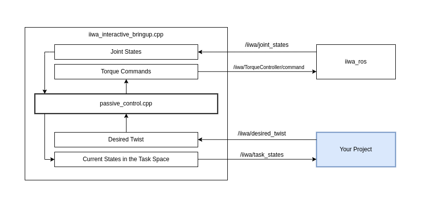

# iiwa_interactive_controller

Passive DS control interface for KUKA. Modified from [dual_iiwa_toolkit](https://github.com/penn-figueroa-lab/dual_iiwa_toolkit).


## System Diagram
To understand how this repo can help with your project, here is a system diagram.



## Requirements

- [iiwa_ros](https://github.com/penn-figueroa-lab/iiwa_ros)

## Basic Usage

### Gazebo

```
roslaunch iiwa_interactive_controller passiveDS_gazebo.launch
```


### Real Kuka
Follow the [Kuka wiki](https://github.com/penn-figueroa-lab/lab_wiki/wiki/Kuka) to setup the robot, replace step 6a with this following launch file.

```
roslaunch iiwa_interactive_controller passiveDS_real.launch
```

### Example
An example task file (position_interface.cpp) is provided. The robot end effector will follow a linear DS in this example.
```
roslaunch iiwa_interactive_controller passiveDS_<gazebo|real>.launch example:=true
```


### Use it with your own project

#### Twist Interface
```
roslaunch iiwa_interactive_controller passiveDS_<gazebo|real>.launch control_interface:=twist
```

Your project can publish ```geoemtry_msgs/Twist``` messages to the ```/iiwa/desired_twist``` topic


#### Position Interface
```
roslaunch iiwa_interactive_controller passiveDS_<gazebo|real>.launch control_interface:=position
```

Your project can publish ```geoemtry_msgs/Pose``` messages to the ```/iiwa/desired_pos``` topic


